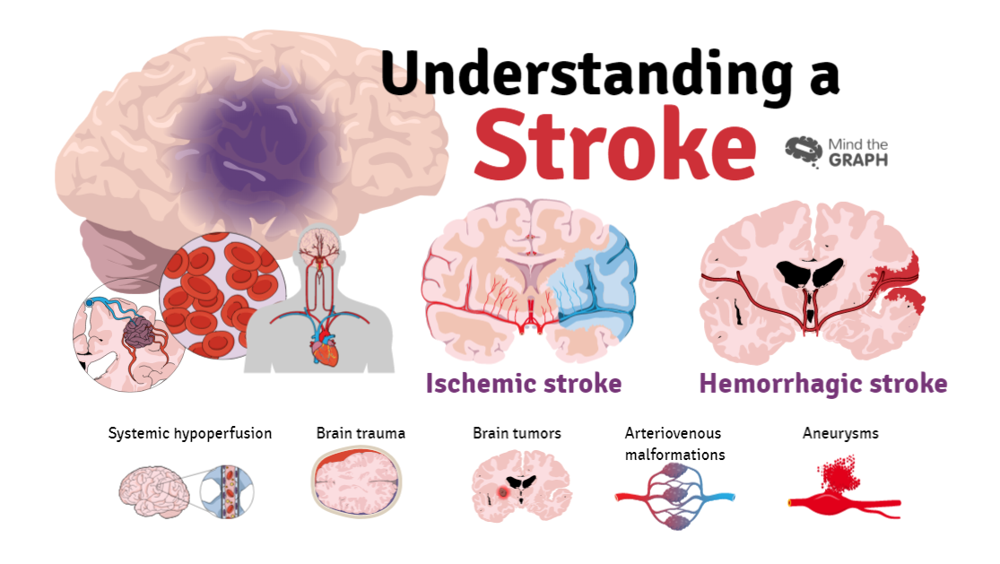

# Early Stroke Prediction
According to the World Health Organization (WHO) stroke is the 2nd leading cause of death globally, responsible for approximately 11% of total deaths.
This dataset is used to predict whether a patient is likely to get stroke based on the input parameters like gender, age, various diseases, and smoking status. Each row in the data provides relavant information about the patient.

## Attribute Information
1) id: unique identifier
2) gender: "Male", "Female" or "Other"
3) age: age of the patient
4) hypertension: 0 if the patient doesn't have hypertension, 1 if the patient has hypertension
5) heart_disease: 0 if the patient doesn't have any heart diseases, 1 if the patient has a heart disease
6) ever_married: "No" or "Yes"
7) work_type: "children", "Govt_jov", "Never_worked", "Private" or "Self-employed"
8) Residence_type: "Rural" or "Urban"
9) avg_glucose_level: average glucose level in blood
10) bmi: body mass index
11) smoking_status: "formerly smoked", "never smoked", "smokes" or "Unknown"*
12) stroke: 1 if the patient had a stroke or 0 if not
*Note: "Unknown" in smoking_status means that the information is unavailable for this patient

## Task
Developing Explainable machine learning-based stroke prediction using advance algorithms


## Authors

- [@Dauda Sani Abdullahi](https://www.github.com/pydawud)

## Methods Used
- Inferential statistics
- Data Visulization
- Machine Learning
- Explainable Artificial Intelligence
## Technologies

- Pandas
- missingno
- Numpy
- Matplotlib
- Seaborn
- XGBoost
- CatBoost
- LightGBM


## Installation

Install Anaconda or install pandas, seaborn, matplotlib, numpy with `pip` or `cond`, then clone the repo as:

```bash
  clone https://github.com/pydawud/stroke-prediction.git
  cd stroke-prediction
```
    
## 🚀 About Me
I'm a Machine learning Enthusiast with interest in Explainable Artificial Intelligence. 


## 🛠 Skills
Python, Pandas, Numpy, Seaborn, Scikitlearn, pytorch, Beautiful Soup.


## Feedback

If you have any feedback, please reach out to us at daudasaniaa008@gmail.com


## License


[](https://opensource.org/licenses/)
